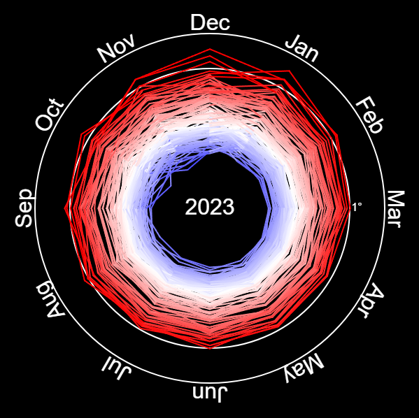
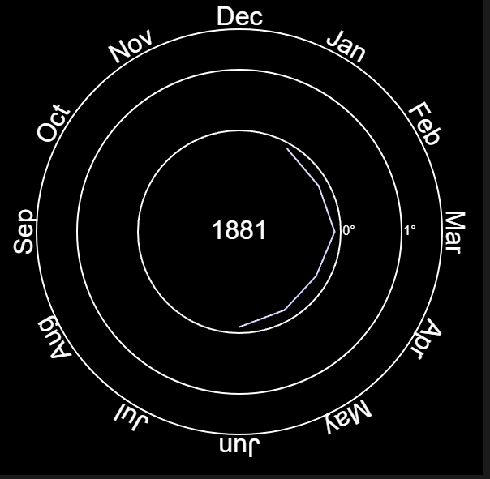

# 🌍 Climate Spiral Visualization

This exercise involves creating a climate spiral with [p5js](https://p5js.org/) following along with the exercise in [How to Code a Climate Spiral](https://www.youtube.com/watch?v=rVBTxnRyOuE) by The Coding Train.





## Instructions

1. Navigate to [NASA GISS Data page](https://data.giss.nasa.gov/gistemp/) and download Global-mean monthly, seasonl, and annual means in `CSV` format
2. Remove header row that is not part of data set.
3. Download P5.js files and move them to this directory

## Reference

**[p5 Tables](https://p5js.org/reference/#/p5.Table)**

Stores the data as tables.

## Troubleshooting

### CORS Policy

When I initially tried to load the data file, I got an error

```
Access to fetch at 'file://learning/data/giss-data-july-17-2023.csv' from origin 'null' has been blocked by CORS policy: Cross origin requests are only supported for protocol schemes: http, data, isolated-app, chrome-extension, chrome, https, chrome-untrusted.
```

I found from this helpful [StackOverflow article](https://stackoverflow.com/questions/10752055/cross-origin-requests-are-only-supported-for-http-error-when-loading-a-local) that even though I was running this locally, I need to run on a webserver becaus the protocol needs to match and `file` is not a match for this script. So, I ran it on a local webserver instead.

