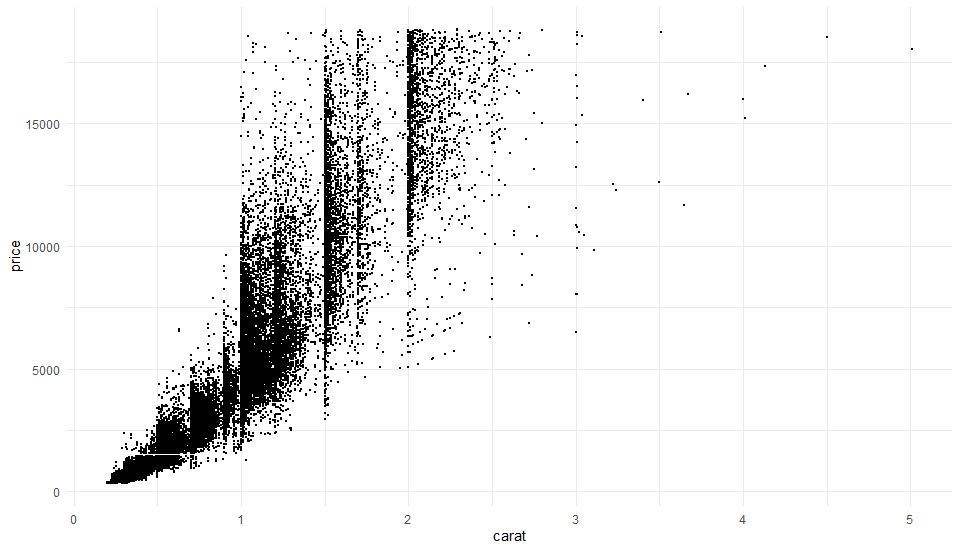
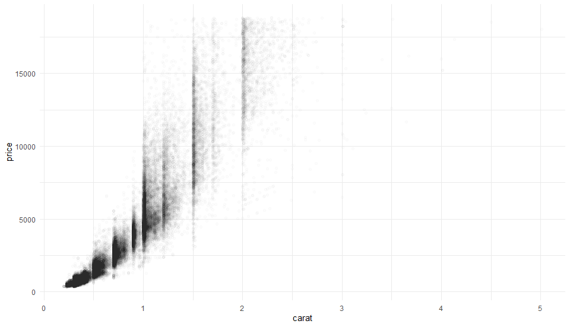
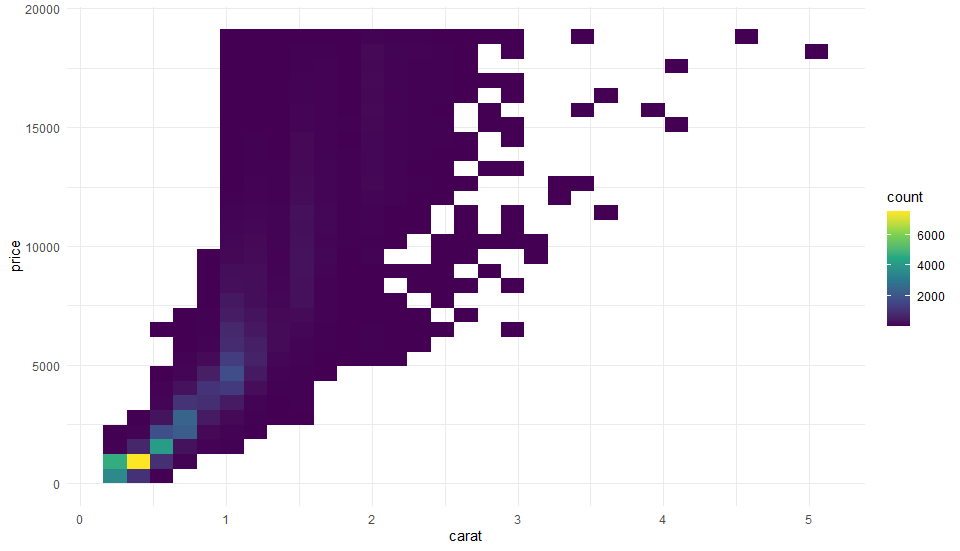
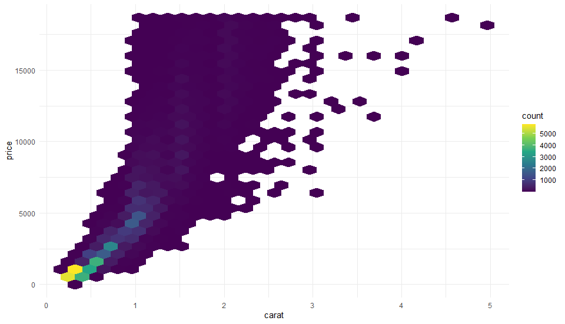
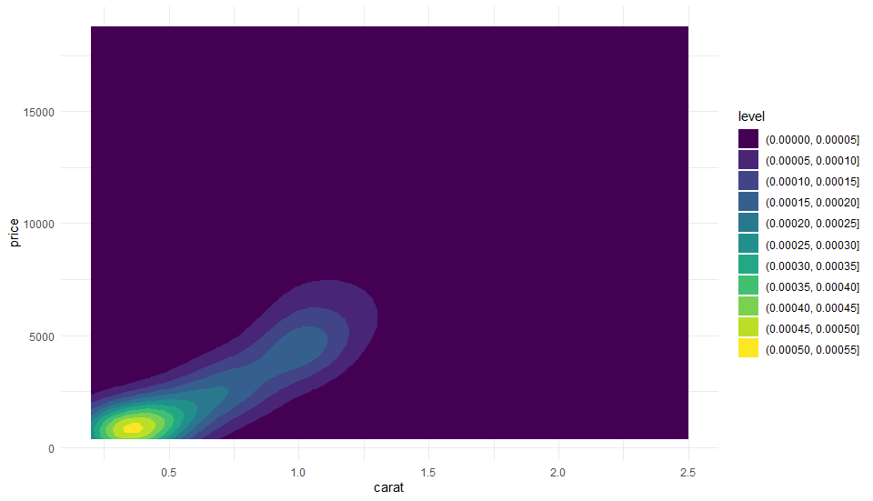
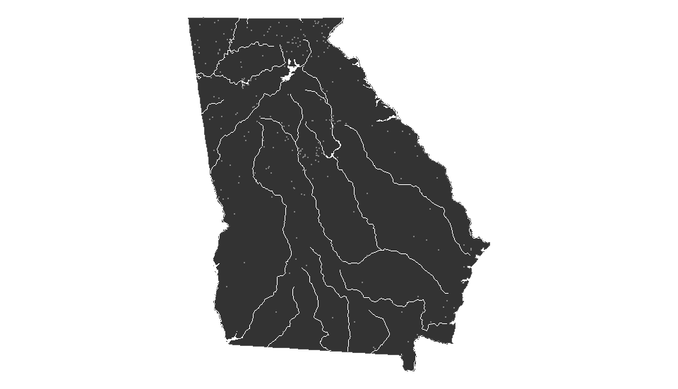
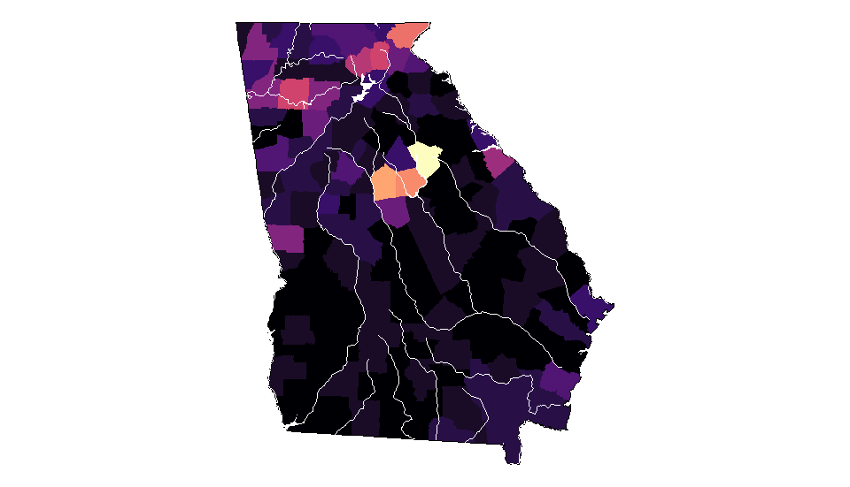
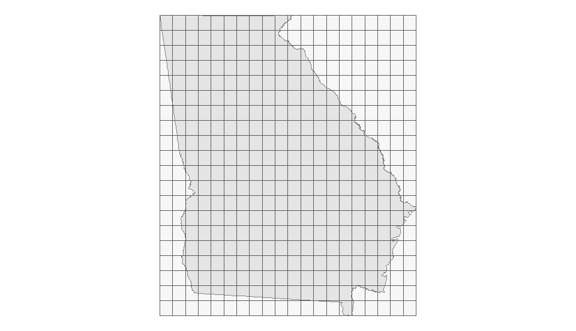
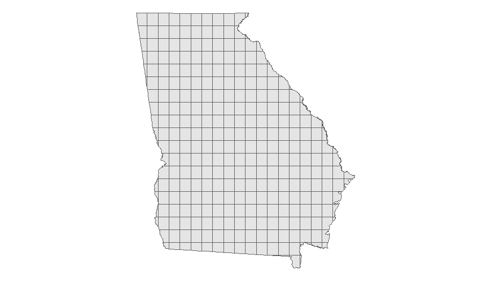
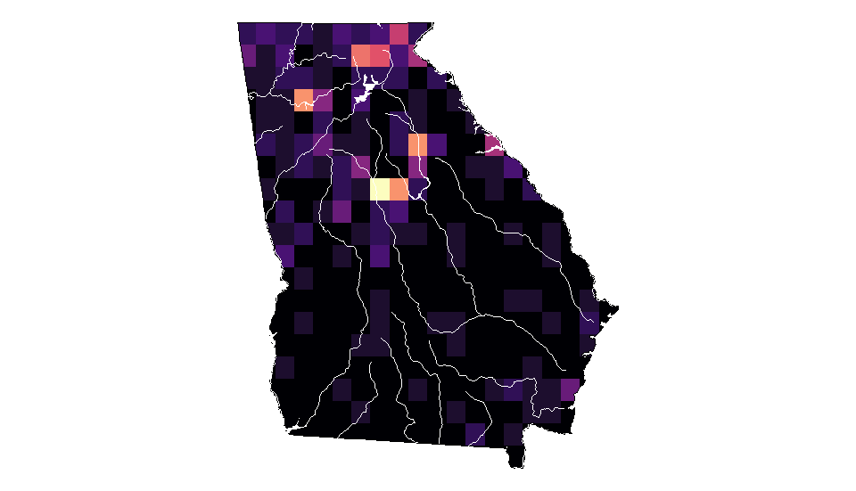

# Gradient Map Fills

An exercise to learn about fixing overplotted points in R. This exercise comes from [the blog of Andrew Heiss](https://www.andrewheiss.com/blog/2023/07/28/gradient-map-fills-r-sf/index.html)

# What is overplotting?

**Overplotting** is what happens when there are too many data ponts in one place. An example is this scatterplot of diamond carats and prices

> 

## Potential fixes

### Smaller points

> 

### Transparency

You can fix the overplotting with some transparency. **Alpha** ranges from 0 (completely transparent) to 1 (completely solid). This is with an alpha of 0.01

> 

### Binning the points in boxes

You can draw a grid across the axes and color each box based on the count of dots in each square

> 

### Binning the points in boxes

You can draw a hex grid across the axes and color each box based on the count of dots in each square

> 

### Density contour

You can also create a sort of heat map (it looks a lot like thermal vision) by plotting the contours of the density of points in each area of the axes. This is another way to use color to indicate the density where the single point plots will not.

> 

--- 

# Geographic data

This gets trickier with maps because we're not dealing with nice tidy rectangles, even if we do still have an x/y axis.

## Georgia Campgrounds

We start by plotting the state of Georgia by itself.

> 

### Grouped by County

We can solve for overplotting by mapping campground count by county.

> 

Alternatively, we could make our own grid boxes of even sizes and plot there.

> 
> 
> 
