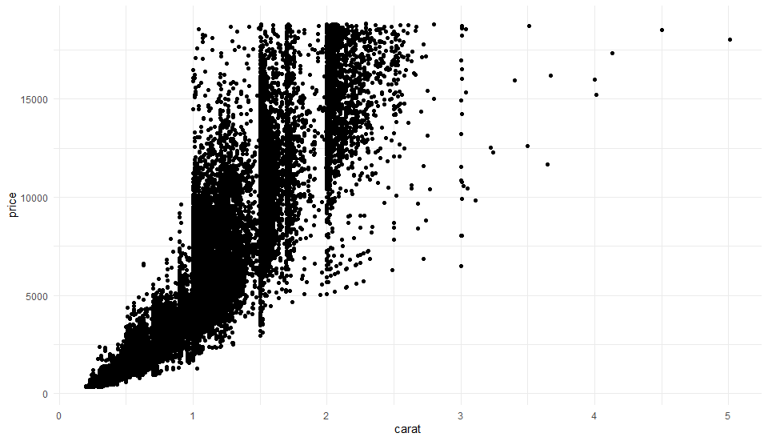

# Gradient Map Fills

An exercise to learn about fixing overplotted points in R. This exercise comes from [the blog of Andrew Heiss](https://www.andrewheiss.com/blog/2023/07/28/gradient-map-fills-r-sf/index.html)

## What is overplotting?

**Overplotting** is what happens when there are too many data ponts in one place. An example is this scatterplot of diamond carats and prices

> 